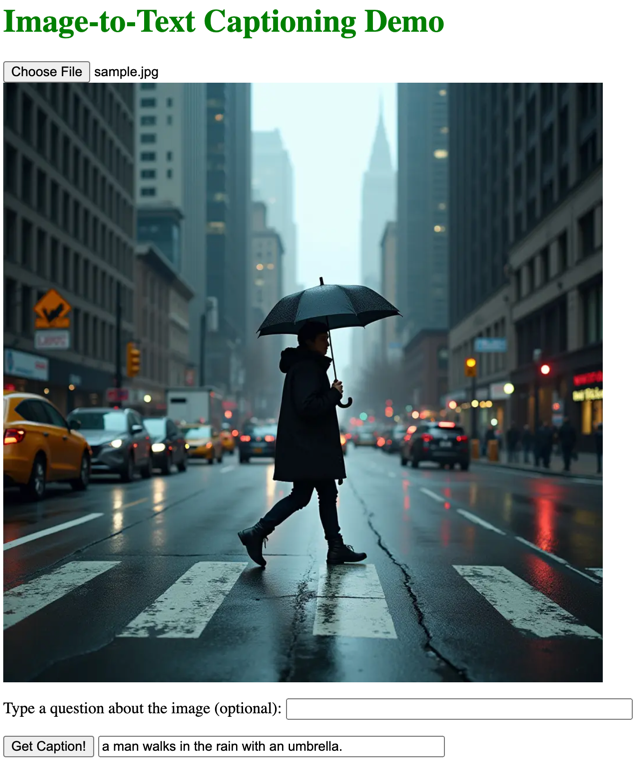

# itt
Image-to-text practice repo

Simple front-end graphical user interface (HTML and jQuery) to interact with back-end (Flask) and perform image-to-text captioning with artificial intelligence models from [huggingface](https://huggingface.co/models?pipeline_tag=image-to-text&sort=downloads).

- Running without Triton Inference Server
  - Run file `src/app.py`
  - Open web browser
  - Navigate to http://localhost:5000/
- Running with Triton Inference Server (Python backend)
  - Create Docker images by running file `docker_compose_python.sh`
  - Open web browser
  - Navigate to http://localhost:5000/

Using the tool:
1. Upload image
2. Click on "Get Caption!"

Optionally, type a question for executing a Visual Question Answering task.